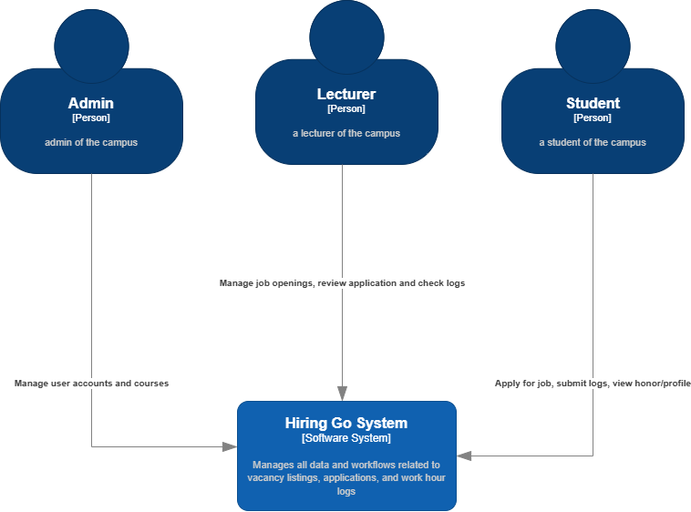

# Context Diagram

# Container Diagram

# Deployment Diagram

# Future Software Architcture
## Future Container Diagram

## Future Deployment Diagram

# Justifikasi
Sebagai hasil dari risk analysis yang telah dilakukan, kelompok kami memutuskan untuk melakukan justifikasi terhadap perubahan arsitektur sistem guna meminimalisir risiko yang telah diidentifikasi. Salah satu temuan utama dari analisis risiko tersebut adalah penggunaan satu basis data bersama untuk seluruh layanan dalam sistem. Model arsitektur seperti ini memiliki beberapa kelemahan signifikan, di antaranya adalah adanya single point of failure dan keterbatasan skalabilitas. Single point of failure merupakan kondisi di mana kegagalan pada satu komponen utama, dalam hal ini basis data, dapat menyebabkan seluruh sistem tidak dapat berfungsi. Hal ini tentu sangat berisiko terutama untuk sistem yang membutuhkan ketersediaan tinggi (high availability). Selain itu, keterbatasan skalabilitas muncul karena beban kerja seluruh layanan terpusat pada satu basis data, sehingga jika terjadi peningkatan traffic atau permintaan, performa sistem secara keseluruhan dapat menurun dan sulit untuk dioptimalkan.

Untuk mengatasi risiko-risiko tersebut, kelompok kami memutuskan untuk memodifikasi arsitektur dengan memisahkan basis data untuk setiap layanan (service). Dengan cara ini, jika terjadi gangguan pada satu layanan atau basis data, layanan lain tetap dapat berjalan dengan normal tanpa terganggu. Pemisahan basis data juga memberikan keuntungan dalam aspek keamanan, karena akses data setiap layanan dapat dibatasi dan dikelola secara lebih spesifik sesuai kebutuhan. Selain itu, pendekatan ini memudahkan pengelolaan serta pengembangan tiap layanan secara mandiri, sehingga proses scaling atau penambahan fitur baru dapat dilakukan dengan lebih fleksibel. Keputusan ini diambil sebagai bentuk tanggung jawab kelompok dalam menjaga kualitas, ketahanan, dan keberlanjutan sistem yang dikembangkan.